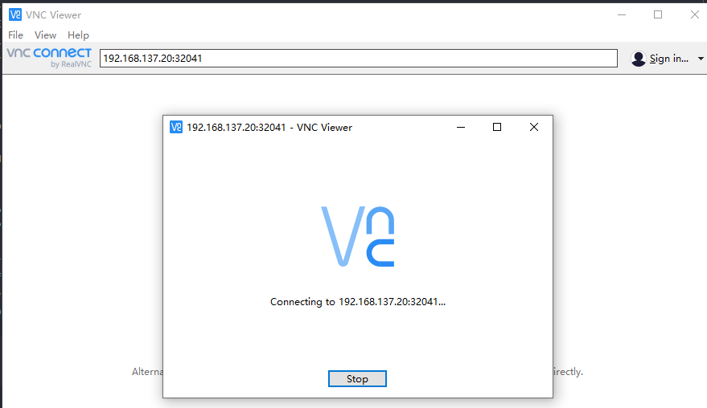
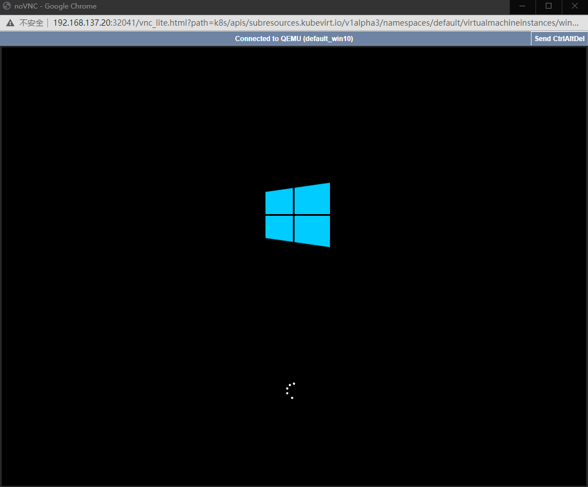
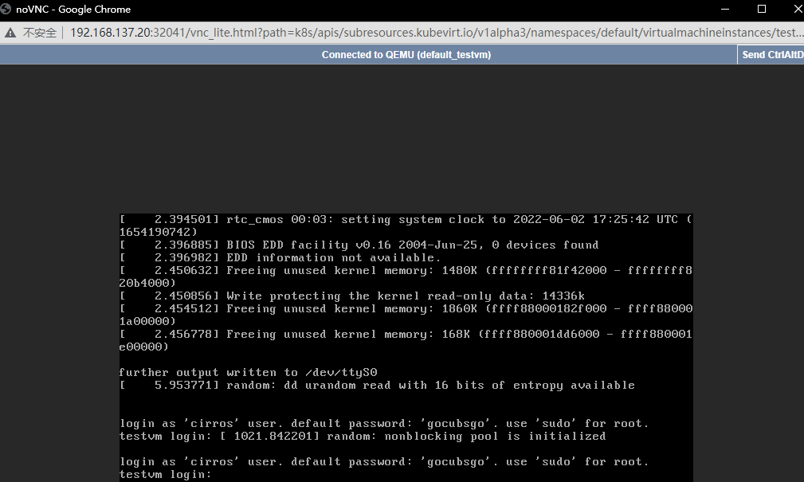

整个流程概括就是去微软官网下载win10安装盘iso文件，用KubeVirt的CDI的uploadproxy服务，将安装镜像导入Kubernetes的PVC，然后在Kubernetes的Pod中启动win10虚拟机，之后的操作就和laptop上的操作一样了。

```bash
[root@node1 ~]# ll Win10_20H2_Chinese\(Simplified\)_x64.iso 
-rw-r--r--. 1 root root 6044921856 Jun  2 23:49 Win10_20H2_Chinese(Simplified)_x64.iso
[developer@localhost ~]$ virtctl image-upload  --image-path='Win10_20H2_Chinese(Simplified)_x64.iso'  --pvc-name=iso-win10  --pvc-size=7G  --uploadproxy-url=https://10.107.110.21  --insecure  --wait-secs=240
Using existing PVC default/iso-win10
Uploading data to https://10.107.110.21

 0 B / 5.63 GiB [-----------------------------------------------------------------------------------------------------------------------------------------------------------------------------------------------------------------------------------------------]   0.00% 5s
You are using a client virtctl version that is different from the KubeVirt version running in the cluster
Client Version: v0.52.0
Server Version: v0.49.0
Post "https://10.107.110.21/v1alpha1/upload": read tcp 192.168.137.10:44904->10.107.110.21:443: read: connection reset by peer
```
> 上传失败，需要client和server的版本统一起来，需要部署hostpath-provisioner
```bash
[root@k8s ~]# kubectl create -f https://github.com/cert-manager/cert-manager/releases/download/v1.7.1/cert-manager.yaml
customresourcedefinition.apiextensions.k8s.io/certificaterequests.cert-manager.io created
customresourcedefinition.apiextensions.k8s.io/certificates.cert-manager.io created
customresourcedefinition.apiextensions.k8s.io/challenges.acme.cert-manager.io created
customresourcedefinition.apiextensions.k8s.io/clusterissuers.cert-manager.io created
customresourcedefinition.apiextensions.k8s.io/issuers.cert-manager.io created
customresourcedefinition.apiextensions.k8s.io/orders.acme.cert-manager.io created
namespace/cert-manager created
serviceaccount/cert-manager-cainjector created
serviceaccount/cert-manager created
serviceaccount/cert-manager-webhook created
configmap/cert-manager-webhook created
clusterrole.rbac.authorization.k8s.io/cert-manager-cainjector created
clusterrole.rbac.authorization.k8s.io/cert-manager-controller-issuers created
clusterrole.rbac.authorization.k8s.io/cert-manager-controller-clusterissuers created
clusterrole.rbac.authorization.k8s.io/cert-manager-controller-certificates created
clusterrole.rbac.authorization.k8s.io/cert-manager-controller-orders created
clusterrole.rbac.authorization.k8s.io/cert-manager-controller-challenges created
clusterrole.rbac.authorization.k8s.io/cert-manager-controller-ingress-shim created
clusterrole.rbac.authorization.k8s.io/cert-manager-view created
clusterrole.rbac.authorization.k8s.io/cert-manager-edit created
clusterrole.rbac.authorization.k8s.io/cert-manager-controller-approve:cert-manager-io created
clusterrole.rbac.authorization.k8s.io/cert-manager-controller-certificatesigningrequests created
clusterrole.rbac.authorization.k8s.io/cert-manager-webhook:subjectaccessreviews created
clusterrolebinding.rbac.authorization.k8s.io/cert-manager-cainjector created
clusterrolebinding.rbac.authorization.k8s.io/cert-manager-controller-issuers created
clusterrolebinding.rbac.authorization.k8s.io/cert-manager-controller-clusterissuers created
clusterrolebinding.rbac.authorization.k8s.io/cert-manager-controller-certificates created
clusterrolebinding.rbac.authorization.k8s.io/cert-manager-controller-orders created
clusterrolebinding.rbac.authorization.k8s.io/cert-manager-controller-challenges created
clusterrolebinding.rbac.authorization.k8s.io/cert-manager-controller-ingress-shim created
clusterrolebinding.rbac.authorization.k8s.io/cert-manager-controller-approve:cert-manager-io created
clusterrolebinding.rbac.authorization.k8s.io/cert-manager-controller-certificatesigningrequests created
clusterrolebinding.rbac.authorization.k8s.io/cert-manager-webhook:subjectaccessreviews created
role.rbac.authorization.k8s.io/cert-manager-cainjector:leaderelection created
role.rbac.authorization.k8s.io/cert-manager:leaderelection created
role.rbac.authorization.k8s.io/cert-manager-webhook:dynamic-serving created
rolebinding.rbac.authorization.k8s.io/cert-manager-cainjector:leaderelection created
rolebinding.rbac.authorization.k8s.io/cert-manager:leaderelection created
rolebinding.rbac.authorization.k8s.io/cert-manager-webhook:dynamic-serving created
service/cert-manager created
service/cert-manager-webhook created
deployment.apps/cert-manager-cainjector created
deployment.apps/cert-manager created
deployment.apps/cert-manager-webhook created
mutatingwebhookconfiguration.admissionregistration.k8s.io/cert-manager-webhook created
validatingwebhookconfiguration.admissionregistration.k8s.io/cert-manager-webhook created
[root@k8s ~]# kubectl create -f https://raw.githubusercontent.com/kubevirt/hostpath-provisioner-operator/main/deploy/namespace.yaml
namespace/hostpath-provisioner created
[root@k8s ~]# kubectl create -f https://raw.githubusercontent.com/kubevirt/hostpath-provisioner-operator/main/deploy/operator.yaml -n hostpath-provisioner
serviceaccount/hostpath-provisioner-operator created
clusterrole.rbac.authorization.k8s.io/hostpath-provisioner-operator created
role.rbac.authorization.k8s.io/hostpath-provisioner-operator created
clusterrolebinding.rbac.authorization.k8s.io/hostpath-provisioner-operator created
rolebinding.rbac.authorization.k8s.io/hostpath-provisioner-operator created
customresourcedefinition.apiextensions.k8s.io/hostpathprovisioners.hostpathprovisioner.kubevirt.io created
deployment.apps/hostpath-provisioner-operator created
[root@k8s ~]# kubectl create -f https://raw.githubusercontent.com/kubevirt/hostpath-provisioner-operator/main/deploy/webhook.yaml
issuer.cert-manager.io/selfsigned-issuer created
certificate.cert-manager.io/hostpath-provisioner-operator-webhook-service-cert created
service/hostpath-provisioner-operator-webhook-service created
validatingwebhookconfiguration.admissionregistration.k8s.io/hostpathprovisioner.kubevirt.io created
```

```bash
[root@k8s ~]# ./virtctl image-upload   --image-path='Win10_20H2_Chinese(Simplified)_x64.iso'   --storage-class hostpath-csi   --pvc-name=iso-win10   --pvc-size=10Gi   --uploadproxy-url=https://10.233.6.124   --insecure   --wait-secs=240
PVC default/iso-win10 not found 
PersistentVolumeClaim default/iso-win10 created
Waiting for PVC iso-win10 upload pod to be ready...
Pod now ready
Uploading data to https://10.233.6.124

 5.63 GiB / 5.63 GiB [=========================================================================================================================================================================================================================================] 100.00% 15s
Uploading data completed successfully, waiting for processing to complete, you can hit ctrl-c without interrupting the progress
Processing completed successfully
Uploading Win10_20H2_Chinese(Simplified)_x64.iso completed successfully
```
上传成功，查看pv和pvc。
```bash
[root@k8s ~]# kubectl get pv
NAME                                       CAPACITY   ACCESS MODES   RECLAIM POLICY   STATUS   CLAIM               STORAGECLASS   REASON   AGE
pvc-493bd925-0790-4aa8-ad75-6ce5645e1c80   119Gi      RWO            Delete           Bound    default/iso-win10   hostpath-csi            56s
[root@k8s ~]# kubectl get pvc
NAME        STATUS   VOLUME                                     CAPACITY   ACCESS MODES   STORAGECLASS   AGE
iso-win10   Bound    pvc-493bd925-0790-4aa8-ad75-6ce5645e1c80   119Gi      RWO            hostpath-csi   62s
[root@k8s ~]# cat win10.yaml 
apiVersion: kubevirt.io/v1alpha3
kind: VirtualMachine
metadata:
  name: win10
spec:
  running: false
  template:
    metadata:
      labels:
        kubevirt.io/domain: win10
    spec:
      domain:
        cpu:
          cores: 4
        devices:
          disks:
          - bootOrder: 1
            disk:
              bus: virtio
            name: harddrive
          - bootOrder: 2
            cdrom:
              bus: sata
            name: cdromiso
          - cdrom:
              bus: sata
            name: virtiocontainerdisk
          interfaces:
          - masquerade: {}
            model: e1000
            name: default
        machine:
          type: q35
        resources:
          requests:
            memory: 16G
      networks:
      - name: default
        pod: {}
      volumes:
      - name: cdromiso
        persistentVolumeClaim:
          claimName: iso-win10
      - name: harddrive
        hostDisk:
          capacity: 50Gi
          path: /data/disk.img
          type: DiskOrCreate
      - name: virtiocontainerdisk
        containerDisk:
          image: kubevirt/virtio-container-disk
[root@k8s ~]# kubectl create -f win10.yaml 
The request is invalid: spec.template.spec.volumes[1]: HostDisk feature gate is not enabled
```
创建win10虚拟机，报HostDisk feature gate is not enabled。下面enable HostDisk，
再次创建win10虚拟机，失败，报错因为内存原因调度不到任何节点，因为跑k8s的wmware虚拟机内存16G，win10虚拟机配置了16G内存，所以无法调度，将win10虚拟机内存16G改小到6G再次创建win10虚拟机，get 虚拟机实例，running，并获得ip，可以ping通ip。
```bash
[root@k8s ~]# cat enable-feature-gate.yaml 
---
apiVersion: kubevirt.io/v1
kind: KubeVirt
metadata:
  name: kubevirt
  namespace: kubevirt
spec:
  configuration:
    developerConfiguration: 
      featureGates:
        - HardDisk
        - DataVolumes
        - HostDisk 
[root@k8s ~]# kubectl apply -f enable-feature-gate.yaml 
kubevirt.kubevirt.io/kubevirt configured
[root@k8s ~]# kubectl create -f win10.yaml
virtualmachine.kubevirt.io/win10 created
[root@k8s ~]# kubectl get vm
NAME    AGE   STATUS    READY
win10   7s    Stopped   False
[root@k8s ~]# ./virtctl start win10
VM win10 was scheduled to start
[root@k8s ~]# kubectl describe vm win10|egrep -e 'Status|Message'
        f:printableStatus:
        f:volumeSnapshotStatuses:
Status:
    Message:               Guest VM is not reported as running
    Status:                False
    Message:               0/1 nodes are available: 1 Insufficient memory.
    Status:                False
  Printable Status:        ErrorUnschedulable
  Volume Snapshot Statuses:
  Type    Reason            Age   From                       Message
# 因为跑k8s的wmware虚拟机内存16G，win10虚拟机配置了16G内存，所以无法调度，将win10虚拟机内存16G改小到6G再次创建win10虚拟机
[root@k8s ~]# kubectl create -f win10.yaml 
virtualmachine.kubevirt.io/win10 created
[root@k8s ~]# kubectl get vm
NAME    AGE   STATUS    READY
win10   11s   Stopped   False
[root@k8s ~]# ./virtctl start win10
VM win10 was scheduled to start
[root@k8s ~]# kubectl get vm
NAME    AGE   STATUS     READY
win10   23s   Starting   False
[root@k8s ~]# kubectl get vm
NAME    AGE   STATUS     READY
win10   25s   Starting   False
[root@k8s ~]# kubectl get vmi
NAME    AGE   PHASE        IP    NODENAME   READY
win10   9s    Scheduling                    False
[root@k8s ~]# kubectl get vm
NAME    AGE   STATUS     READY
win10   29s   Starting   False
[root@k8s ~]# kubectl get vmi
NAME    AGE    PHASE     IP             NODENAME   READY
win10   110s   Running   10.233.90.24   node1      True
# ping win10虚拟机的ip可以ping通
[root@k8s ~]# kubectl get vm
NAME    AGE     STATUS    READY
win10   2m13s   Running   True
```

配置kubevirt vnc服务
```yaml
apiVersion: v1
kind: ServiceAccount
metadata:
  name: virtvnc
  namespace: kubevirt
---
kind: ClusterRoleBinding
apiVersion: rbac.authorization.k8s.io/v1
metadata:
  name: virtvnc
subjects:
- kind: ServiceAccount
  name: virtvnc
  namespace: kubevirt
roleRef:
  kind: ClusterRole
  name: virtvnc
  apiGroup: rbac.authorization.k8s.io
---
kind: ClusterRole
apiVersion: rbac.authorization.k8s.io/v1
metadata:
  name: virtvnc
rules:
- apiGroups:
  - subresources.kubevirt.io
  resources:
  - virtualmachineinstances/console
  - virtualmachineinstances/vnc
  verbs:
  - get
- apiGroups:
  - kubevirt.io
  resources:
  - virtualmachines
  - virtualmachineinstances
  - virtualmachineinstancepresets
  - virtualmachineinstancereplicasets
  - virtualmachineinstancemigrations
  verbs:
  - get
  - list
  - watch
---
apiVersion: v1
kind: Service
metadata:
  labels:
    app: virtvnc
  name: virtvnc
  namespace: kubevirt
spec:
  ports:
  - port: 80
    protocol: TCP
    targetPort: 8001
  selector:
    app: virtvnc
  type: LoadBalancer
---
apiVersion: apps/v1
kind: Deployment
metadata:
  name: virtvnc
  namespace: kubevirt
spec:
  replicas: 1
  selector:
    matchLabels:
      app: virtvnc
  template:
    metadata:
      labels:
        app: virtvnc
    spec:
      serviceAccountName: virtvnc
      containers:
      - name: virtvnc
        image: quay.io/samblade/virtvnc:v0.1
        livenessProbe:
          httpGet:
            port: 8001
            path: /
            scheme: HTTP
          failureThreshold: 30
          initialDelaySeconds: 30
          periodSeconds: 10
          successThreshold: 1
          timeoutSeconds: 5
```

kubectl get svc -A 查看vnc service nodeport的端口是32041，用vnc客户端登录

发现连不上，查了之后才知道，上面部署的vnc服务提供的这个ip+port不是某一个vm的vnc的端口，而是web界面，web上展示所有虚拟机的nvc入口链接。如下：

登录win10虚拟机的vnc界面

登录环境中的另一台cirros虚拟机的vnc界面

